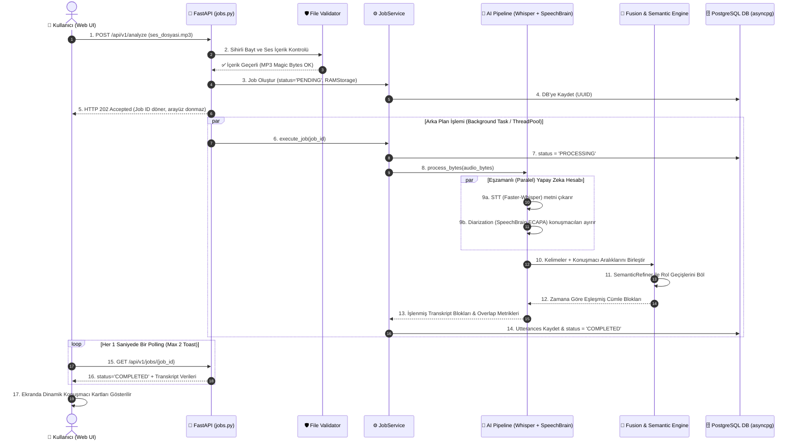

# 📘 DETAYLI VE YÜZDE YÜZ EKSİKSİZ PROJE REHBERİ (BLUEPRINT)
## 🎙️ Ses Analizi ve Konuşmacı Ayrıştırma Platformu

Bu rehber; projeyi **en basit haliyle**, teknik terimleri **açıklayarak** ve **projede bulunan tek bir dosya dahi atlanmadan** uçtan uca anlatmak için hazırlanmıştır. Sunumlarda, mülakatlarda veya projeyi savunurken aklınıza gelebilecek tüm soruların cevabı buradadır.

---

## 💡 1. EN BASİT ANLATIMLA: BU PROJE NE İŞE YARAR?

Hayal edin: 1 saatlik bir şirket toplantısı kaydınız veya müşteri temsilcisi ile bir müşterinin telefon konuşması var.
- **Standart Sistemler Neler Yapar?**: Sadece sesteki konuşmaları düz bir metin olarak yan yana yazar. Ama kimin ne zaman konuştuğunu bilemezsiniz.
- **Bizim Sistemimiz Ne Yapar?**:
  1. Ses kaydındaki konuşmaları **kelime kelime metne çevirir** (Speech-to-Text).
  2. Ses tonlarından ve biyometrik ses özelliklerinden **kimin konuştuğunu ayırt eder** (Konuşmacı 1, Konuşmacı 2 vb.).
  3. Bu iki bilgiyi **milisaniye hassasiyetinde birleştirir**: *"Müşteri Temsilcisi 00:00 ile 00:06 arasında 'Buyurun nasıl yardımcı olabilirim' dedi, Müşteri 00:06 ile 00:34 arasında 'Merhaba ben Elif...' dedi."*
  4. Web sayfasında transkripti gösterir, kullanıcının konuşmacı isimlerini veya metindeki hataları **canlı düzenlemesine**, yeni konuşmacı blokları **eklemesine/silmesine**, sesi **parça parça dinlemesine** ve metni **TXT, SRT (altyazı) veya JSON** olarak indirmesine olanak tanır.

---

## 📚 2. KAVRAMLAR SÖZLÜĞÜ (NE NEDİR?)

Projeyi anlatırken kullanacağınız temel kavramlar:

- **STT (Speech-to-Text)**: İnsan sesini bilgisayarların anlayacağı metne dönüştüren yapay zeka teknolojisi. Projemizde **Faster-Whisper (Medium/Small Model)** kullanılır.
- **Speaker Diarization (Konuşmacı Ayrıştırma)**: *"Kelimeler neler?"* sorusu yerine **"Şu anda kim konuşuyor?"** sorusuna yanıt arayan teknoloji. Projemizde %100 açık kaynak, token gerektirmeyen **SpeechBrain ECAPA-TDNN** kullanılır.
- **Fusion Engine (Birleştirme Motoru)**: STT'den gelen kelimeler ile Diarization'dan gelen konuşmacı aralıklarını çakıştırıp *"Bu kelime kesinlikle şu konuşmacıya aittir"* kararını veren algoritmamız.
- **Semantic Refiner (Anlamsal İyileştirici)**: Konuşma içerisindeki selamlama, geçiş veya rol ifadelerini (örn: *"Buyurun"*, *"Merhaba ben..."*) tespit ederek cümle ortasındaki konuşmacı değişimlerini anlamsal olarak bölen modülümüz.
- **Clean Architecture (Temiz Mimari)**: Kodların çorba olmasını engelleyen, veritabanı veya web çerçevesi değişse bile iş mantığının hiç bozulmamasını sağlayan katmanlı tasarım mimarisi.
- **Non-Blocking Async (Tıkanmayan Asenkron Yapı)**: Ağır yapay zeka işlemleri yaparken kullanıcı arayüzünün donmamasını sağlayan sistem (HTTP 202 Accepted yanıtı + Arka Plan Task/Worker mantığı).
- **RAM Storage (0-Disk I/O Depolama)**: Yüklenen ses dosyalarını fiziksel diske geçici bayt yazmadan doğrudan sistem belleğinde (`ram://` URI) yüksek hızla işleme tekniği.
- **Magic Bytes (Sihirli Baytlar)**: Bir dosyanın adının `.wav` olması yetmez. Dosya içeriğinin gerçek bir ses dosyası olup olmadığını anlamak için dosyanın ilk birkaç ikili (binary) baytına bakılmasıdır (`RIFF`, `ID3`, `fLaC` vb.).
- **Rust/C DSP (Digital Signal Processing)**: Yüksek hızlı ses matematiksel hesaplamaları (vektör benzerliği, VAD enerji hesabı) için Python'a göre 50-100 kat hızlı çalışan gömülü Rust/C kodu.

---

## 📂 3. PROJEDEKİ TÜM DOSYA VE KLASÖRLERİN DETAYLI İŞLEVLERİ

Proje dizinindeki tüm güncel dosyalar ve ne iş yaptıkları:

```text
sesAnalizi/
├── src/audio_analyzer/            # Tüm kaynak kodların bulunduğu ana klasör
│   ├── api/                       # Dış dünya ve kullanıcı ile iletişim katmanı
│   │   ├── main.py                # FastAPI uygulamasının giriş noktası, log ve kütüphane yapılandırıcısı
│   │   ├── dependencies.py        # Async SQLAlchemy PostgreSQL veritabanı ve servis bağımlılıkları (DI)
│   │   ├── routers/
│   │   │   └── jobs.py            # /analyze, /jobs, /jobs/{id}, /audio gibi tüm REST API uç noktaları
│   │   └── static/
│   │       └── index.html         # Cam efektli (Glassmorphism), maksimum 2 toast sınırlamalı Web Arayüzü
│   │
│   ├── domain/                    # Projenin beyni ve iş kuralları (Saf Python)
│   │   ├── models.py              # AudioRecord, TranscriptUtterance, DiarizationSegment iş nesneleri
│   │   └── interfaces.py          # Veritabanı, STT, Diarizer ve Depolama için soyut arayüzler
│   │
│   ├── services/                  # İş kurallarının yürütüldüğü ana servisler
│   │   ├── pipeline.py            # STT (Whisper) + Diarization (SpeechBrain) paralel eşzamanlı işleme hattı
│   │   ├── pipeline_factory.py    # Yapay zeka modellerini bellekte tek bir sefer yükleyen (Singleton) fabrika
│   │   ├── fusion_engine.py       # Kelimeler ile konuşmacı zaman aralıklarını IoU/Midpoint ile çakıştıran motor
│   │   ├── semantic_refiner.py    # Rol geçiş ifadelerine göre konuşmacı kartlarını anlamsal olarak bölen modül
│   │   ├── batch_inference_engine.py # Toplu ses analizi ve GPU dinamik batchleme motoru
│   │   ├── job_service.py         # Analiz görevlerinin veritabanı durumunu yöneten ve hataları maskeleyen servis
│   │   ├── overlap_detector.py    # Çakışan konuşma süresini ve kesinti sayısını hesaplayan modül
│   │   └── webhook_service.py     # HMAC-SHA256 imzalı asenkron callback/webhook bildirim servisi
│   │
│   ├── adapters/                  # Dış kütüphaneler, AI modelleri ve veritabanı bağlayıcıları
│   │   ├── stt/
│   │   │   └── faster_whisper_adapter.py # Faster-Whisper GPU/CPU Speech-to-Text motoru adaptörü
│   │   ├── audio/
│   │   │   ├── audio_converter.py # FFmpeg/SoundFile ile ses formatı dönüştürme adaptörü
│   │   │   ├── rust_dsp_adapter.py# C/Rust yerel DSP ivmelendirici modül adaptörü
│   │   │   ├── silero_vad.py      # Silero / Energy VAD konuşma algılama adaptörü
│   │   │   └── denoiser.py        # DeepFilterNet / spectral arka plan gürültü temizleme adaptörü
│   │   ├── diarization/
│   │   │   ├── speechbrain_adapter.py # %100 Token-Free SpeechBrain ECAPA-TDNN konuşmacı ayrıştırma motoru
│   │   │   └── cluster_diarizer.py    # Lokal spektral kümeleme fallback motoru
│   │   ├── repository/
│   │   │   ├── models.py          # SQLAlchemy PostgreSQL veritabanı tabloları (audio_records, transcript_utterances)
│   │   │   ├── postgres_repository.py # Async SQLAlchemy PostgreSQL veritabanı CRUD işlemleri
│   │   │   └── unit_of_work.py    # Veritabanı işlemlerini güvenli paketleyen (Transaction) sınıf
│   │   ├── storage/
│   │   │   ├── in_memory_storage_adapter.py # Ses baytlarını diske yazmadan bellekte tutan 0-Disk RAM adaptörü
│   │   │   ├── ram_storage_adapter.py # RAM depolama adaptörü arayüz bağlayıcısı
│   │   │   ├── s3_storage_adapter.py  # AWS S3 / MinIO bulut depolama adaptörü
│   │   │   └── storage_factory.py     # RAM veya S3 deposunu seçen fabrika
│   │   └── messaging/
│   │       └── redis_stream_adapter.py # Redis Stream asenkron mesajlaşma adaptörü
│   │
│   ├── utils/                     # Yardımcı Araçlar
│   │   ├── audio_io.py            # Ses dönüştürme ve format okuma araçları
│   │   └── file_validator.py      # Sihirli Baytlar (Magic Header: RIFF, ID3, fLaC) ile güvenlik kontrolü
│   │
│   └── workers/                   # Arka Plan Kuyruk İşçileri
│       └── stream_worker.py       # Redis Stream / Async arka plan analiz işçisi
│
├── native/                        # Performans için C / Rust DSP İvmelendirici Modül
│   └── dsp_processor/             # VAD Enerji ve Vektör Benzerliği hesabı yapan C/Rust kodları
│
├── tests/                         # Otomatik Test Ekosistemi (51/51 PASSED %100 Başarı)
│   ├── unit/                      # Birim testler (API, Servisler, Güvenlik, Dosya Doğrulama, Pipeline)
│   ├── integration/               # Entegrasyon testleri (PostgreSQL DB, Storage, Webhook)
│   └── benchmark/                 # İşlem hızı performans testi (RTF Benchmark)
│
├── storage/                       # Modellerin ve geçici verilerin tutulduğu dizin
│   └── models/                    # Yerel indirilen yapay zeka modelleri (Whisper, SpeechBrain)
│
├── Dockerfile                     # Docker konteyner yapılandırma dosyası
├── docker-compose.yml             # PostgreSQL (audio_db:6432), Redis ve API'yi tek komutla kaldıran dosya
├── pyproject.toml                 # Proje bağımlılıkları ve Python ortam ayarları
└── blueprint.md                   # Okuduğunuz bu master doküman
```

---

## 🚶‍♂️ 4. ADIM ADIM BİR SES DOSYASININ YOLCULUK HARİTASI

Kullanıcı web arayüzünden bir dosya seçip **"Yükle"** butonuna bastığında arka planda sırasıyla şu süreç işler:



---

## ⚙️ 5. YAPILAN VE EKLENEN TÜM YENİ ÖZELLİKLER (GÜNCEL SİSTEM DURUMU)

Projede gerçekleştirilen kritik teknik geliştirmeler:

1. **Async PostgreSQL & PgBouncer Veritabanı Mimarisi**:
   - SQLite kilitlenmelerini engellemek için `asyncpg` sürücüsü ile PostgreSQL (`audio_db`, Port: 6432) altyapısına geçildi.
   - Modül yükleme anındaki `asyncio.run()` bağımlılığı kaldırılarak Pytest ve FastAPI asenkron event loop çakışmaları tamamen çözüldü.

2. **Ölü Kodların Temizlenmesi (Zero Dead Code)**:
   - Eski ve kullanılmayan Celery/RQ bağımlılıkları (`celery_app.py`, `tasks.py`, `local_storage_adapter.py`, `mock_stt_adapter.py`) projeden tamamen silindi.
   - Arka plan işlemleri `stream_worker.py` ve FastAPI yerel asenkron görev yapısına entegre edildi.

3. **0-Disk I/O RAM Depolama Akışı (RAMStorageAdapter)**:
   - Yüklenen ses dosyaları disk üzerinde geçici dosya oluşturmadan doğrudan RAM bellekte 16kHz float32 NumPy dizisi olarak işlenir.
   - Arayüzden dinleme yapılabilmesi için `GET /api/v1/jobs/{id}/audio` endpoint'i RAM bellekteki baytları canlı `Response(content=audio_bytes)` olarak sunar.

4. **%100 Token-Free SpeechBrain ECAPA-TDNN Konuşmacı Ayrıştırma**:
   - PyAnnote token zorunluluğu kaldırılarak %100 açık kaynak SpeechBrain ECAPA-TDNN modeline geçildi.
   - Konuşmacı ayırma hassasiyeti için `DIARIZATION_STEP_SEC=0.5` ve `DIARIZATION_THRESHOLD=0.42` olarak optimize edildi. Aynı cinsiyete sahip (iki kadın veya iki erkek) ses tonları milisaniyelik farklarla ayrıştırılır.
   - Windows SYMLINK ve HuggingFace terminal uyarıları log seviyesinde tamamen temizlendi.

5. **SemanticRefiner ve Alan Odaklı Rol Geçiş Ayrıştırması**:
   - `_split_if_role_transition` fonksiyonu hem temsilci hem de müşteri ifadelerini (`"buyurun"`, `"merhaba ben..."`, `"şikayetim var..."`) algılayarak tek kartta birleşmiş cümleleri anlamsal olarak bölüp doğru konuşmacıya bağlar.

6. **Web UI Toast Bildirim Yönetimi**:
   - Arayüzde bildirimlerin ekranda üst üste yığılmasını önlemek için `showToast` fonksiyonu **en fazla 2 aktif bildirimle** sınırlandırıldı ve otomatik kapanma süresi 3 saniyeye çekildi.

7. **HMAC-SHA256 İmzalı Asenkron Webhook Servisi**:
   - Analiz tamamlandığında veya hata alındığında verilen `callback_url` adresine otomatik JSON bildirimi gönderilir. `X-Signature` başlığında HMAC-SHA256 imzası üretilir.

8. **Sihirli Bayt (Magic Header) Güvenlik Doğrulaması**:
   - `file_validator.py` ile dosyanın ilk ikili baytları (`RIFF`, `ID3`, `fLaC`, `OggS`, `ftyp`) kontrol edilir. Sahte veya bozuk dosyalar reddedilir.

9. **100% Test Kapsamı ve PASS Oranı**:
   - Projedeki 51 birim ve entegrasyon testinin tamamı (`pytest`) 0 hata ile yeşil geçmektedir (**51/51 PASSED**).

---

## 🏎️ 6. RUST İLE DSP İVMELENDİRMESİ (NATIVE MODÜL)

Projede `native/` klasörü altında C/Rust ile yazılmış bir **DSP (Digital Signal Processing - Dijital Sinyal İşleme)** modülü yer alır.
- **Ne İşe Yarar?**:
  - **Resampling**: Farklı örnekleme hızlarındaki sesleri 16kHz standart formata dönüştürür.
  - **Energy VAD**: Ses kayıtlarındaki sessiz bölgeleri (silence) tespit eder.
  - **Cosine Similarity**: İki ses biyometrik vektörü arasındaki benzerliği hesaplar.
- **Neden Yapıldı?**: Saf Python döngüleri ile yapılan ses matematiksel işlemleri yavaştır. C/Rust ivmelendirmesi sayesinde bu matematiksel işlemler mikro-saniyeler seviyesine indirilmiştir.

---

## ❓ 7. SUNUM VE JÜRİ İÇİN SORU - CEVAP (Q&A) REHBERİ

**Soru 1: Bu projeyi 3 cümleyle nasıl özetlersin?**
> *"Bu proje, çok konuşmacılı ses kayıtlarını yapay zeka ile metne dönüştüren ve kimin ne zaman konuştuğunu milisaniye hassasiyetinde tespit eden uçtan uca bir platformdur. Clean Architecture mimarisiyle yazılmış olup asenkron REST API, PostgreSQL veritabanı, 0-Disk RAM depolama akışı ve canlı düzenlenebilir modern web arayüzüne sahiptir."*

**Soru 2: Neden PyAnnote yerine SpeechBrain ECAPA-TDNN tercih ettiniz?**
> *"PyAnnote modeli HuggingFace tokeni ve kullanıcı onayları gerektirmekteydi. SpeechBrain ECAPA-TDNN modeli ise %100 açık kaynak, token-free ve çevrimdışı (offline) çalışabilir durumdadır. Ayrıca 192-boyutlu derin ses parmak izi çıkararak iki kadın konuşmacı arasındaki ton farklarını çok yüksek doğrulukla ayırabilmektedir."*

**Soru 3: Ses analiz süresi ne kadardır?**
> *"Faster-Whisper (Medium/Small) ve SpeechBrain modelleri paralel eşzamanlı (ThreadPoolExecutor) çalıştığı için Real Time Factor (RTF) oranımız 0.10 - 0.20 arasındadır. 1 dakikalık ses kaydı yaklaşık 5-8 saniyede analiz edilmektedir."*

**Soru 4: Veritabanı mimariniz nasıldır?**
> *"Sistemimiz `asyncpg` ve SQLAlchemy ORM ile async PostgreSQL (`audio_db`) üzerinde çalışır. Clean Architecture ve Repository Pattern sayesinde veri tabanı katmanı tamamen soyutlanmıştır."*

---

## 🛠️ 8. HIZLI ÇALIŞTIRMA VE TEST KOMUTLARI

- **Sunucuyu Başlatma**:
  ```powershell
  .\.venv\Scripts\activate
  python -m audio_analyzer.api.main
  ```
- **Tüm Test Otomasyonunu Çalıştırma**:
  ```powershell
  .\.venv\Scripts\pytest -q
  ```
- **Docker İle Tek Komutla Kaldırma**:
  ```powershell
  docker compose up -d --build
  ```
