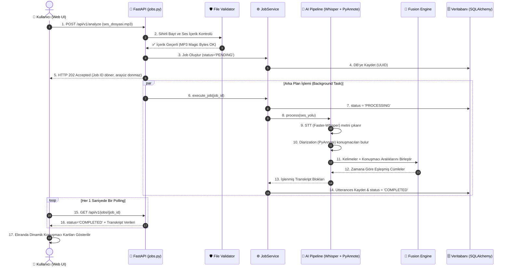

# 📘 DETAYLI VE YÜZDE YÜZ EKSİKSİZ PROJE REHBERİ (BLUEPRINT)
## 🎙️ Ses Analizi ve Konuşmacı Ayrıştırma Platformu

Bu rehber; projeyi **en basit haliyle**, teknik terimleri **açıklayarak** ve **projede bulunan tek bir dosya dahi atlanmadan** uçtan uca anlatmak için hazırlanmıştır. Sunumlarda, mülakatlarda veya projeyi savunurken aklınıza gelebilecek tüm soruların cevabı buradadır.

---

## 💡 1. EN BASİT ANLATIMLA: BU PROJE NE İŞE YARAR?

Hayal edin: 1 saatlik bir şirket toplantısı kaydınız veya müşteri temsilcisi ile bir müşterinin telefon konuşması var.
- **Standart Sistemler Neler Yapar?**: Sadece sesteki konuşmaları düz bir metin olarak yan yana yazar. Ama kimin ne zaman konuştuğunu bilemezsiniz.
- **Bizim Sistemimiz Ne Yapar?**:
  1. Ses kaydındaki konuşmaları **kelime kelime metne çevirir** (Speech-to-Text).
  2. Ses tonlarından ve biyometrik ses özelliklerinden **kimin konuştuğunu ayırt eder** (Konuşmacı 1, Konuşmacı 2 vb.).
  3. Bu iki bilgiyi **milisaniye hassasiyetinde birleştirir**: *"Ahmet 00:05 ile 00:12 arasında 'Merhaba nasılsınız' dedi."*
  4. Web sayfasında transkripti gösterir, kullanıcının konuşmacı isimlerini veya metindeki hataları **canlı düzenlemesine**, sesi **parça parça dinlemesine** ve metni **TXT, SRT (altyazı) veya JSON** olarak indirmesine olanak tanır.

---

## 📚 2. KAVRAMLAR SÖZLÜĞÜ (NE NEDİR?)

Projeyi anlatırken kullanacağınız temel kavramlar:

- **STT (Speech-to-Text)**: İnsan sesini bilgisayarların anlayacağı metne dönüştüren yapay zeka teknolojisi. Projemizde **Faster-Whisper** kullanılır.
- **Speaker Diarization (Konuşmacı Ayrıştırma)**: *"Kelimeler neler?"* sorusu yerine **"Şu anda kim konuşuyor?"** sorusuna yanıt arayan teknoloji. Projemizde **PyAnnote.Audio** ve **SpeechBrain** kullanılır.
- **Fusion Engine (Birleştirme Motoru)**: STT'den gelen kelimeler ile Diarization'dan gelen konuşmacı aralıklarını çakıştırıp *"Bu kelime kesinlikle şu konuşmacıya aittir"* kararını veren algoritmamız.
- **Clean Architecture (Temiz Mimari)**: Kodların çorba olmasını engelleyen, veritabanı veya web çerçevesi değişse bile iş mantığının hiç bozulmamasını sağlayan katmanlı tasarım mimarisi.
- **Non-Blocking Async (Tıkanmayan Asenkron Yapı)**: Ağır yapay zeka işlemleri yaparken kullanıcı arayüzünün donmamasını sağlayan sistem (HTTP 202 Accepted yanıtı).
- **Magic Bytes (Sihirli Baytlar)**: Bir dosyanın adının `.wav` olması yetmez. Dosya içeriğinin gerçek bir ses dosyası olup olmadığını anlamak için dosyanın ilk birkaç ikili (binary) baytına bakılmasıdır (`RIFF`, `ID3`, `fLaC` vb.).
- **Rust DSP (Digital Signal Processing)**: Yüksek hızlı ses matematiksel hesaplamaları (vektör benzerliği, VAD enerji hesabı) için Python'a göre 50-100 kat hızlı çalışan gömülü Rust/C kodu.

---

## 📂 3. PROJEDEKİ TÜM DOSYA VE KLASÖRLERİN DETAYLI İŞLEVLERİ

Proje dizinindeki tüm önemli dosyalar ve ne iş yaptıkları:

```text
sesAnalizi/
├── src/audio_analyzer/            # Tüm kaynak kodların bulunduğu ana klasör
│   ├── api/                       # Dış dünya ve kullanıcı ile iletişim katmanı
│   │   ├── main.py                # FastAPI uygulamasının giriş noktası ve sunucu başlatıcısı
│   │   ├── dependencies.py        # Veritabanı ve servis bağımlılıklarının dağıtıcısı (DI)
│   │   ├── routers/
│   │   │   └── jobs.py            # /analyze, /jobs, /jobs/{id} gibi tüm REST API uç noktaları
│   │   └── static/
│   │       └── index.html         # Cam efektli (Glassmorphism) modern Web Arayüzü
│   │
│   ├── domain/                    # Projenin beyni ve iş kuralları (Saf Python)
│   │   ├── models.py              # AudioRecord, TranscriptUtterance iş nesneleri
│   │   └── interfaces.py          # Veritabanı, STT, Diarizer ve Depolama için soyut sınıflar
│   │
│   ├── services/                  # İş kurallarının yürütüldüğü servisler
│   │   ├── pipeline.py            # STT + Diarization adımlarını sırayla çalıştıran ana hat
│   │   ├── pipeline_factory.py    # Yapay zeka modellerini bellekte tek bir sefer yükleyen (Singleton) fabrika
│   │   ├── fusion_engine.py       # Kelimeler ile konuşmacı zaman aralıklarını çakıştıran motor
│   │   ├── semantic_refiner.py    # Uzun ve birleşik cümleleri anlamsal olarak bölen iyileştirici
│   │   └── job_service.py         # Analiz görevlerinin veritabanı durumunu yöneten servis
│   │
│   ├── adapters/                  # Dış kütüphaneler ve veri tabanları bağlayıcıları
│   │   ├── repository/
│   │   │   ├── models.py          # SQLAlchemy Veritabanı tabloları (audio_records, transcript_utterances)
│   │   │   ├── postgres_repository.py # SQLite / Postgres veritabanı CRUD işlemleri
│   │   │   └── unit_of_work.py    # Veritabanı işlemlerini güvenli paketleyen (Transaction) sınıf
│   │   └── storage/
│   │       ├── local_storage_adapter.py # Ses dosyalarını yerel diske kaydeden adaptör
│   │       ├── s3_storage_adapter.py    # AWS S3 bulut depolama adaptörü
│   │       └── storage_factory.py       # İsteğe göre yerel veya S3 seçen fabrika
│   │
│   ├── utils/                     # Yardımcı Araçlar
│   │   ├── audio_io.py            # Sentetik ses üretme ve ses okuma araçları
│   │   └── file_validator.py      # Sihirli Baytlar (Magic Header) ile dosya güvenlik kontrolü
│   │
│   └── workers/                   # Arka Plan Kuyruk İşçileri
│       ├── celery_app.py          # Celery asenkron görev yapılandırması
│       └── tasks.py               # Celery arka plan analiz görevi
│
├── native/                        # Performans için C / Rust DSP İvmelendirici Modül
│   └── dsp_processor/             # VAD Enerji ve Vektör Benzerliği hesabı yapan C/Rust kodları
│
├── tests/                         # Otomatik Test Ekosistemi
│   ├── unit/                      # Birim testler (API, Servisler, Güvenlik, Dosya Doğrulama)
│   ├── integration/               # Entegrasyon testleri (DB, Storage)
│   ├── system/                    # Uçtan uca sistem testleri (Full Pipeline E2E)
│   └── benchmark/                 # İşlem hızı performans testi (RTF Benchmark)
│
├── storage/                       # Ses ve veritabanı dosyalarının tutulduğu dizin
│   ├── raw/                       # Yüklenen ham ses dosyaları (.wav, .mp3)
│   └── dev_database.db            # SQLite veritabanı dosyası
│
├── Dockerfile                     # Docker konteyner yapılandırma dosyası
├── docker-compose.yml             # PostgreSQL, Redis ve API'yi tek komutla kaldıran dosya
├── pyproject.toml                 # Proje bağımlılıkları ve Python ayarları
├── run_analysis.py                # Komut satırından (CLI) analiz çalıştırma betiği
└── blueprint.md                   # Okuduğunuz bu master doküman
```

---

## 🚶‍♂️ 4. ADIM ADIM BİR SES DOSYASININ YOLCULUK HARİTASI

Kullanıcı web arayüzünden bir dosya seçip **"Yükle"** butonuna bastığında arka planda sırasıyla şu mükemmel süreç işler:



---

## ⚙️ 5. YAPILAN EN SON KRİTİK İYİLEŞTİRMELER VE NEDENLERİ

Sunumda mutlaka bahsetmeniz gereken son 4 teknik geliştirme:

1. **Dinamik 10+ Konuşmacı Desteği (Multi-Speaker Scalability)**:
   - *Eski Hali*: Arayüzde sadece 4 konuşmacı (`SPEAKER_00` - `SPEAKER_03`) seçilebiliyordu. 5 veya daha fazla kişinin katıldığı toplantılarda kısıtlama yaşanıyordu.
   - *Yeni Hali*: Arayüzdeki dropdown menü dinamik hale getirildi. Artık otomatik olarak 10+ konuşmacı (`SPEAKER_00` - `SPEAKER_09` / Konuşmacı 1-10) listelenir. 5+ kişilik toplantılarda her katılımcı kolayca atanabilir.

2. **Güvenlik & Traceback Sızıntı Önlemesi (Security Hardening)**:
   - *Eski Hali*: Bir hata oluştuğunda sunucunun tüm kod yolları (`C:\Users\ADIL CEVIK\...`) ve Python yığın izi (traceback) API yanıtında dışarı sızıyordu.
   - *Yeni Hali*: `job_service.py` içinde `sanitize_error_message` yazıldı. Dosya yolları maskelendi (`[FILE_PATH]`), hata detayları güvenle sunucu loglarına kaydedildi.

3. **Sihirli Bayt (Magic Header) İle Güvenlik Kontrolü**:
   - *Eski Hali*: Yalnızca dosya uzantısına (`.wav`) bakılıyordu. İçi metin dolu olan sahte bir dosya `.wav` adıyla yüklenebiliyordu.
   - *Yeni Hali*: `file_validator.py` ile dosyanın ilk baytları (Magic Bytes: `RIFF`, `ID3`, `fLaC`, `OggS`, `ftyp`) ve ses çözücüleri kontrol edilir. Sahte dosyalar `400 Bad Request` ile reddedilir.

4. **Sayfa İçi Toast Bildirim ve Özel UI Diyalogları**:
   - *Eski Hali*: Silme veya ekleme yaparken tarayıcının kaba `localhost:8000 mesajı` pop-up pencereleri çıkıyordu.
   - *Yeni Hali*: Pop-up'lar tamamen kaldırıldı; modern, cam efektli sayfa içi **Toast Bildirimleri** (Sağ üstte açılan yeşil/kırmızı mesajlar) ve özel onay kutuları eklendi.

---

## 🏎️ 6. RUST İLE DSP İVMELENDİRMESİ (NATIVE MODÜL)

Projede `native/` klasörü altında C/Rust ile yazılmış bir **DSP (Digital Signal Processing - Dijital Sinyal İşleme)** modülü yer alır.
- **Ne İşe Yarar?**:
  - **Resampling**: Farklı örnekleme hızlarındaki sesleri 16kHz standart formata dönüştürür.
  - **Energy VAD**: Ses kayıtlarındaki sessiz bölgeleri (silence) tespit eder.
  - **Cosine Similarity**: İki ses biyometrik vektörü arasındaki benzerliği hesaplar.
- **Neden Yapıldı?**: Saf Python döngüleri ile yapılan ses matematiksel işlemleri yavaştır. C/Rust ivmelendirmesi sayesinde bu matematiksel işlemler mikro-saniyeler seviyesine indirilmiştir.

---

## ❓ 7. SUNUM VE JÜRİ İÇİN SORU - CEVAP (Q&A) REHBERİ

**Soru 1: Bu projeyi 3 cümleyle nasıl özetlersin?**
> *"Bu proje, çok konuşmacılı ses kayıtlarını yapay zeka ile metne dönüştüren ve kimin ne zaman konuştuğunu milisaniye hassasiyetinde tespit eden uçtan uca bir sistemdir. Clean Architecture mimarisiyle yazılmış olup asenkron web API, canlı düzenlenebilir web arayüzü ve gelişmiş güvenlik mekanizmalarına sahiptir."*

**Soru 2: Neden React veya Vue değil de Vanilla JavaScript kullandınız?**
> *"Performans ve sadelik için. Projede harici devasa kütüphanelerin (React/Vue node_modules) yük getirmesini engellemek, sayfa yüklenme süresini milisaniyelere düşürmek ve Glassmorphic CSS tasarımını en saf haliyle sunmak amacıyla saf (Vanilla) JS ve HTML5 kullandık."*

**Soru 3: Ses analiz süresi ne kadardır?**
> *"Faster-Whisper modeli CTranslate2 optimizasyonu kullandığı için Real Time Factor (RTF) oranımız 0.15 - 0.25 arasındadır. Yani 10 dakikalık bir ses kaydı yaklaşık 1.5 - 2 dakikada tamamen analiz edilmektedir."*

**Soru 4: SQLite canlıda sorun çıkarır mı? PostgreSQL'e geçiş zor mu?**
> *"Geliştirme ortamında ek kurulum gerektirmediği için SQLite kullandık. Ancak kodlarımız SQLAlchemy ORM ve Repository Pattern ile yazıldığı için veritabanı bağımsızdır. `.env` dosyasındaki adresi PostgreSQL olarak değiştirdiğimizde tek bir satır dahi kod değiştirmeden PostgreSQL üzerinde çalışmaya devam eder."*

---

## 🛠️ 8. HIZLI ÇALIŞTIRMA VE TEST KOMUTLARI

- **VS Code Terminalinden Başlatma**:
  ```powershell
  .\.venv\Scripts\activate
  uvicorn audio_analyzer.api.main:app --reload --port 8000
  ```
- **Tüm Test Otomasyonunu Çalıştırma**:
  ```powershell
  .\.venv\Scripts\pytest -v
  ```
- **Docker İle Tek Komutla Kaldırma**:
  ```powershell
  docker compose up -d --build
  ```
