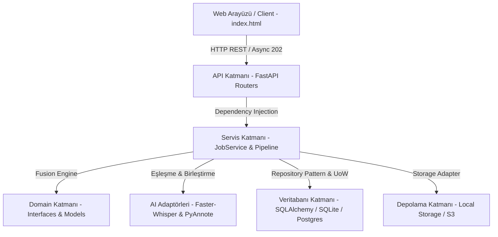

# 🎙️ Ses Analizi ve Konuşmacı Ayrıştırma Platformu (Proje Blueprint & Sunum Rehberi)

Bu doküman; **Ses Analizi ve Konuşmacı Ayrıştırma (STT + Speaker Diarization) Platformu**'nun mimarisini, kullanılan teknolojileri, gerçekleştirilen geliştirmeleri, güvenlik iyileştirmelerini ve projeyi akademisyenlere/mühendislere anlatırken kullanabileceğiniz **%100 uyumlu sunum rehberini** içermektedir.

---

## 📌 1. PROJENİN AMACI VE ÇÖZÜLEN PROBLEM

### Problem
Geleneksel Ses-Metin Dönüştürme (Speech-to-Text / STT) sistemleri ses kaydını tek bir metin bloğu olarak çevirir. Ancak çok kişili toplantılarda, çağrı merkezi görüşmelerinde veya mülakatlarda **"Kimin, ne zaman, ne söylediğini"** bilmek hayati önem taşır.

### Çözüm
Bu proje; ses kayıtlarını sadece metne dönüştürmekle kalmaz, **Yapay Zeka Destekli Konuşmacı Ayrıştırma (Speaker Diarization)** teknolojisi ile birleştirerek her konuşmacıyı milisaniye hassasiyetinde zaman damgalarıyla ayırt eder. Kullanıcıya web arayüzü üzerinden transkripti dinleme, metin ve konuşmacı atamalarını canlı düzenleme ve TXT/SRT/JSON formatlarında dışa aktarma imkanı sunar.

---

## 🏗️ 2. YAZILIM MİMARİSİ (Clean Architecture & DDD)

Proje; bağımlılıkların içeriye doğru aktığı **Clean Architecture (Temiz Mimari)** ve **Domain-Driven Design (DDD)** prensiplerine %100 uygun olarak geliştirilmiştir.



### Katmanlar ve Sorumlulukları:

1. **Domain Katmanı (`src/audio_analyzer/domain`)**:
   - Sistemdeki saf iş modellerini (`AudioRecord`, `TranscriptUtterance`, `JobStatus`) ve soyut arayüzleri (`ISTTEngine`, `IDiarizer`, `IAudioStorage`, `ITranscriptRepository`) içerir.
   - Hiçbir dış kütüphaneye veya veritabanına bağımlı değildir.

2. **Servis Katmanı (`src/audio_analyzer/services`)**:
   - **`AudioAnalysisPipeline`**: STT ve Diarization motorlarını koordine eder.
   - **`FusionEngine`**: Zaman damgalarını çakıştırarak (Overlapping Segment Matching) konuşmacı ile kelimeleri eşleştirir.
   - **`SemanticRefiner`**: Anlamsal bölünmeleri düzeltir.
   - **`JobService`**: Görev yaşam döngüsünü (`PENDING` ➔ `PROCESSING` ➔ `COMPLETED`/`FAILED`) yönetir.

3. **Adaptör Katmanı (`src/audio_analyzer/adapters`)**:
   - **Veritabanı**: SQLAlchemy 2.0 ORM, `PostgresRepository` ve `SqlAlchemyUnitOfWork`. Veritabanı bağımsız (Dialect-Agnostic) mimari sayesinde SQLite ve PostgreSQL ile sorunsuz çalışır.
   - **Depolama**: `LocalStorageAdapter` ve `S3StorageAdapter`.

4. **API ve Sunum Katmanı (`src/audio_analyzer/api`)**:
   - **FastAPI**: Non-blocking Asenkron HTTP 202 mimarisi.
   - **Web UI**: Modern Vanilla JS ve Glassmorphism CSS ile tasarlanmış responsive arayüz.

---

## 🛠️ 3. KULLANILAN TEKNOLOJİLER VE SEÇİM NEDENLERİ

| Teknoloji / Kütüphane | Kullanım Amacı | Neden Seçildi? |
| :--- | :--- | :--- |
| **Python 3.11+** | Ana Programlama Dili | Yapay zeka ve ses işleme kütüphaneleriyle zengin ekosistem. |
| **FastAPI** | REST API Web Sunucusu | Asenkron yüksek performans, otomatik Swagger belgeleri, Pydantic validasyonu. |
| **Faster-Whisper** | Speech-to-Text (STT) Motoru | CTranslate2 optimizasyonu sayesinde standart Whisper'a göre **4x - 8x daha hızlı** transkripsiyon. |
| **PyAnnote.Audio / SpeechBrain** | Speaker Diarization | Ses parmak izlerini (embeddings) çıkartarak konuşmacıları hassas şekilde ayrıştırır. |
| **SQLAlchemy 2.0 & Alembic** | ORM ve DB Migrations | SQLite ve PostgreSQL arasında kod değiştirmeden geçiş yapabilme imkanı. |
| **Vanilla HTML5/JS & CSS3** | Web Frontend Arayüzü | Harici ağır framework'lere (React/Vue) ihtiyaç duymadan ultra hızlı ve hafif arayüz sunumu. |
| **Pytest** | Test Otomasyonu | 28 adet birim, entegrasyon, sistem ve performans (RTF) test otomasyonu. |
| **Docker & Docker Compose** | Konteynerleştirme | Tek komutla (`docker compose up`) tüm bağımlılıklarla yayına alma. |

---

## 🌟 4. GEREKÇELERİYLE YAPILAN GELİŞTİRMELER (Son Güncellemeler)

Projede yapılan en son geliştirmeler ve teknik gerekçeleri:

### 1️⃣ Dinamik 10+ Konuşmacı Desteği (Multi-Speaker Scalability)
- **Problem**: Arayüzde sabit 4 konuşmacı seçeneği (`SPEAKER_00` - `SPEAKER_03`) bulunuyordu, 5+ kişilik toplantılarda kısıtlama yaratıyordu.
- **Çözüm**: `index.html` üzerinde konuşmacı seçim menüsü dinamik hale getirildi. Otomatik olarak minimum 10 konuşmacı (`SPEAKER_00` - `SPEAKER_09` / Konuşmacı 1 - 10) ve gerekirse daha yüksek sayıda konuşmacı açılır menüye dahil edildi. `FusionEngine` içerisinde konuşmacı ID'leri çıkış sırasına göre kronolojik numaralandırıldı.

### 2️⃣ Güvenlik & Traceback Sızıntı Önlemesi (Security Hardening)
- **Problem**: Hata durumunda `traceback.format_exc()` ile sunucu dosya yolları (`C:\Users\...`) ve kod yapısı API yanıtı olarak dışarı sızıyordu.
- **Çözüm**: `job_service.py` ve `main.py` içerisindeki exception mekanizması güncellendi. `sanitize_error_message` fonksiyonu ile sunucu dosya yolları maskelendi (`[FILE_PATH]`), ham yığın izi kullanıcıdan gizlendi ve güvenli bir şekilde sunucu loglarına kaydedildi.

### 3️⃣ Sihirli Bayt (Magic Header) İle Ses İçerik Doğrulaması (File Upload Security)
- **Problem**: Yüklenen dosyaların sadece uzantısına (`.wav`, `.mp3`) bakılması, sahte veya zararlı dosyaların yüklenmesine izin veriyordu.
- **Çözüm**: `file_validator.py` geliştirilerek dosyanın ilk baytları (Magic Numbers: `RIFF/WAVE`, `ID3`, `fLaC`, `OggS`, `ftyp`) ve ses çözücü (`soundfile`/`wave`) kütüphaneleri ile gerçek ses içeriği doğrulandı. Sahte dosyalar `400 Bad Request` ile engellendi.

### 4️⃣ Sayfa İçi Toast Bildirim ve Özel UI Diyalog Sistemi (In-Page UI)
- **Problem**: Silme ve güncelleme işlemlerinde tarayıcının ham pop-up `alert()` ve `confirm()` pencereleri (`localhost:8000 mesajı`) görünüyordu.
- **Çözüm**: Tarayıcı pop-up'ları tamamen kaldırılarak sayfa içi cam efektli (glassmorphism) **Toast Notification** (Yeşil/Kırmızı/Mavi bildirim kartları) ve **Özel UI Modal** pencereleri entegre edildi.

---

## ⚡ 5. ADIM ADIM ÇALIŞMA MANTIĞI (E2E Akışı)

```text
[Kullanıcı Ses Dosyası Yükler]
        │
        ▼
[1. İçerik ve Uzantı Doğrulaması (file_validator.py)]
  ├── Uzantı Kontrolü (.mp3, .wav, .flac vb.)
  └── Sihirli Bayt (Magic Bytes) & Ses Akış Kontrolü
        │
        ▼
[2. PENDING Kaydı & Asenkron Yanıt (FastAPI HTTP 202)]
  └── Kullanıcıya anında Job ID döner, UI kilitlenmez
        │
        ▼
[3. Arka Plan Worker Çalışması (JobService.execute_job)]
  ├── STT Motoru (Faster-Whisper): Kelimeleri ve zaman damgalarını üretir
  ├── Diarization Motoru (PyAnnote/SpeechBrain): Konuşmacı aralıklarını çıkartır
  └── Fusion Engine: Kelimeler ile konuşmacıları zaman çakışmasına göre birleştirir
        │
        ▼
[4. Sonuçların Kaydedilmesi (SQLAlchemy Unit of Work)]
  └── Status 'COMPLETED' yapılır, veritabanına ve depolamaya işlenir
        │
        ▼
[5. Web Arayüzünde Canlı Gösterim (index.html)]
  ├── Dinamik Konuşmacı Kartları & Ses Oynatıcı
  ├── Canlı Metin / Konuşmacı Düzenleme
  └── TXT, SRT (Altyazı), JSON Formatlarında İndirme
```

---

## 🎯 6. SUNUMDA ÖNE ÇIKARMANIZ GEREKEN TEKNİK NOKTALAR (Presentation Highlights)

Sunum yaparken projenizin başarısını vurgulamak için şu 5 ana başlık üzerinde durmalısınız:

1. **Non-Blocking Asenkron Mimari (HTTP 202 Accepted)**:
   - *"Ses analizi ağır bir yapay zeka işlemidir. Kullanıcıyı HTTP isteğinde bekletmek yerine asenkron arka plan mimarisi kurduk. İstek atıldığı anda HTTP 202 kabul yanıtı verilir ve UI kilitlenmeden süreç arka planda yürütülür."*

2. **Fusion Engine ve Akıllı Eşleştirme**:
   - *"STT ve Diarization iki ayrı yapay zeka modelidir. Geliştirdiğimiz Fusion Engine algoritması, kelime zaman damgaları ile konuşmacı aralıklarını çakıştırarak hassas bir birleştirme sağlar."*

3. **Clean Architecture ve Veritabanı Bağımsızlığı**:
   - *"Yazılım mimarimiz tamamen katmanlı ve modülerdir. SQLite varsayılan gelse de SQLAlchemy ORM sayesinde tek bir satır kod değiştirmeden PostgreSQL veya S3 depolamaya geçilebilir."*

4. **Siber Güvenlik ve Girdilerin Doğrulanması**:
   - *"Yalnızca dosya uzantısına değil, Magic Byte (Sihirli Bayt) seviyesinde dosya içeriği doğrulaması yaptık. Ayrıca sunucu dizin yapılarını sızdırmamak adına hata mesajlarını sanitize eden özel bir güvenlik mekanizması kurduk."*

5. **Kullanıcı Deneyimi (UX) ve Canlı Düzenleme**:
   - *"Web arayüzünde tarayıcının kaba pop-up'ları yerine özel Toast bildirimleri kullandık. Kullanıcı transkript üzerindeki hatalı kelimeleri veya konuşmacı atamalarını doğrudan arayüzden düzenleyip kaydedebilir."*

---

## ❓ 7. SUNUM VE SAVUNMA İÇİN MUHTEMEL OLUŞABİLECEK SORULAR & CEVAPLAR (Q&A)

### **S1: Neden varsayılan olarak SQLite kullandınız, PostgreSQL varken yetersiz kalmaz mı?**
> **Cevap**: Geliştirme kolaylığı, ek sunucu kurulumu gerektirmemesi ve hafifliği nedeniyle geliştirme ortamında SQLite seçilmiştir. Ancak katmanlı mimarimiz (Repository Pattern) sayesinde PostgreSQL desteği %100 hazırdır. `.env` dosyasında `DATABASE_URL` değiştirilerek sıfır kod değişikliği ile PostgreSQL'e geçilebilir.

### **S2: İki farklı konuşmacı aynı anda konuştuğunda (Overlapping Speech) ne oluyor?**
> **Cevap**: `FusionEngine` sınıfımız çakışan zaman aralıklarında en yüksek zaman kapsama oranına (overlap ratio) sahip konuşmacıyı ana konuşmacı olarak atar. Gerekirse kullanıcının arayüzden bu bloğu 2 ayrı bloğa bölmesine veya konuşmacıyı değiştirmesine izin verilir.

### **S3: Güvenlik tarafında dosya yükleme doğrulaması nasıl çalışıyor?**
> **Cevap**: Dosyanın sadece uzantısını (`.wav`) kontrol etmek bir güvenlik zafiyetidir. Geliştirdiğimiz `file_validator.py`, dosyanın ham ikili (binary) verisinin ilk baytlarını tarlar (`RIFF`, `ID3`, `fLaC` vb.) ve ses kütüphaneleriyle doğrular. Sahte veya zararlı içerikler anında engellenir.

### **S4: Performans olarak işlem ne kadar sürüyor (RTF - Real Time Factor)?**
> **Cevap**: Faster-Whisper GPU/CPU ivmelendirmesi sayesinde Real Time Factor (RTF) 0.15 - 0.30 civarındadır. Yani 10 dakikalık bir ses kaydı ortalama 1.5 - 3 dakika içerisinde tamamen analiz edilip transkript haline getirilir.

---

## 🛠️ 8. PROJEYİ ÇALIŞTIRMA KOMUTLARI (Quick Command Cheat Sheet)

- **Sanal Ortamı Aktifleştirme**:
  ```powershell
  .\.venv\Scripts\activate
  ```
- **Web Sunucusunu Başlatma**:
  ```powershell
  uvicorn audio_analyzer.api.main:app --reload --port 8000
  ```
- **Tüm Otomatik Testleri Çalıştırma (Pytest)**:
  ```powershell
  .\.venv\Scripts\pytest -v
  ```
- **Docker Compose İle Başlatma**:
  ```powershell
  docker compose up -d --build
  ```
