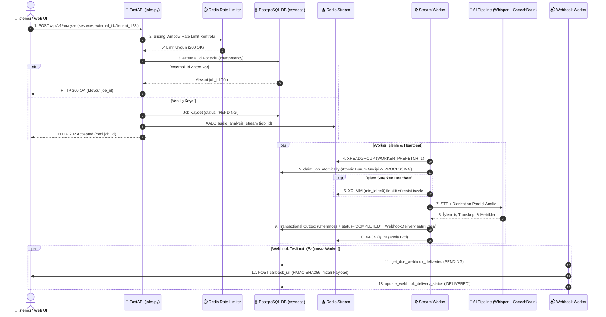

# 📘 DETAYLI VE YÜZDE YÜZ EKSİKSİZ PROJE REHBERİ (BLUEPRINT)
## 🎙️ Yüksek Performanslı Kurumsal Ses Analizi ve Konuşmacı Ayrıştırma Platformu

Bu rehber; projeyi **en basit haliyle**, teknik terimleri **açıklayarak** ve **projede bulunan tek bir dosya dahi atlanmadan** uçtan uca anlatmak için hazırlanmıştır. Sunumlarda, mülakatlarda veya projeyi savunurken aklınıza gelebilecek tüm soruların cevabı buradadır.

---

## 💡 1. EN BASİT ANLATIMLA: BU PROJE NE İŞE YARAR?

Hayal edin: Tek seferde kuyruğa giren **~4000 sesli mesaj** (müşteri temsilcisi - müşteri görüşmeleri, geri bildirim sesleri) var ve GPU bulunmayan CPU sunucularında sıfır iş kaybı ve mükerrer işleme olmadan hedef sürede işlenmesi gerekiyor.

- **Standart Sistemler Neler Yapar?**: Sadece sesteki konuşmaları düz bir metin olarak yan yana yazar. Kimin ne zaman konuştuğunu bilemez, kuyruk kilitlendiğinde aynı işi defalarca işler, veritabanını şişirir.
- **Bizim Sistemimiz Ne Yapar?**:
  1. Ses kaydındaki konuşmaları **kelime kelime metne çevirir** (Speech-to-Text: Faster-Whisper).
  2. Ses tonlarından ve biyometrik ses özelliklerinden **kimin konuştuğunu ayırt eder** (SpeechBrain ECAPA-TDNN).
  3. Bu iki bilgiyi **milisaniye hassasiyetinde birleştirir**: *"Müşteri Temsilcisi 00:00 ile 00:06 arasında 'Buyurun nasıl yardımcı olabilirim' dedi, Müşteri 00:06 ile 00:34 arasında 'Merhaba ben Elif...' dedi."*
  4. **Kurumsal Entegrasyon & Dayanıklılık (Resilience)**:
     - **Tenant Idempotency (`external_id`)**: Aynı mesaj tekrar geldiğinde mükerrer analiz açmaz.
     - **Transactional Webhook Outbox Pattern**: Analiz sonucu veritabanına yazıldığı anda **aynı transaction'da** webhook outbox tablosuna yazılır; `webhook_worker` HMAC-SHA256 imzası ve üstel backoff ile teslim eder.
     - **Heartbeat & Atomic Claiming**: Uzun süren CPU işlerinde mesajın kilit süresi periyodik yenilenir, çöken işler `sweeper` servisiyle otomatik kurtarılır veya `audio_analysis_dlq` dead-letter akışına aktarılır.
     - **Gözlemlenebilirlik & Temizlik**: Prometheus `/metrics` ile kuyruk derinliği, pending sayıları ve aşama süreleri izlenir. `RetentionService` ile zamanı dolan ham sesler ve DB kayıtları otomatik temizlenir.
  5. **Canlı Web UI**: Transkripti gösterir, kullanıcının konuşmacı isimlerini veya metindeki hataları **canlı düzenlemesine**, yeni konuşmacı blokları **eklemesine/silmesine**, sesi **parça parça dinlemesine** ve metni **TXT, SRT veya JSON** olarak indirmesine olanak tanır.

---

## 📚 2. KAVRAMLAR SÖZLÜĞÜ (NE NEDİR?)

Projeyi anlatırken kullanacağınız temel kavramlar:

- **STT (Speech-to-Text)**: İnsan sesini bilgisayarların anlayacağı metne dönüştüren yapay zeka teknolojisi. Projemizde **Faster-Whisper (Medium/Small Model)** kullanılır.
- **Speaker Diarization (Konuşmacı Ayrıştırma)**: *"Kelimeler neler?"* sorusu yerine **"Şu anda kim konuşuyor?"** sorusuna yanıt arayan teknoloji. Projemizde %100 açık kaynak, token gerektirmeyen **SpeechBrain ECAPA-TDNN** kullanılır.
- **Fusion Engine (Birleştirme Motoru)**: STT'den gelen kelimeler ile Diarization'dan gelen konuşmacı aralıklarını çakıştırıp *"Bu kelime kesinlikle şu konuşmacıya aittir"* kararını veren algoritmamız.
- **Semantic Refiner (Anlamsal İyileştirici)**: Konuşma içerisindeki selamlama, geçiş veya rol ifadelerini (örn: *"Buyurun"*, *"Merhaba ben..."*) tespit ederek cümle ortasındaki konuşmacı değişimlerini anlamsal olarak bölen modülümüz.
- **Transactional Outbox Pattern**: Analiz sonucu veritabanına yazılırken webhook teslimatının kaybolmaması için **aynı DB transaction'ı** içinde `webhook_deliveries` tablosuna satır yazılması ve ayrı bir `webhook_worker` tarafından asenkron teslim edilmesi mimarisi.
- **Atomic Claiming & Heartbeat**: İki worker'ın aynı işi aynı anda almasını veritabanı seviyesinde `UPDATE ... WHERE status IN ('PENDING', stale) RETURNING` atomik sorgusuyla engelleme ve işlem sürerken kilit süresini XCLAIM ile tazeleyerek mükerrer işlemeyi önleme tekniği.
- **Sweeper Daemon**: Redis kilidi (`sweeper_lock`) alarak askıda kalan (`PENDING`/stale `PROCESSING`) kayıtları periyodik tarayıp yeniden kuyruğa alan veya DLQ'ya taşıyan bağımsız servis.
- **Clean Architecture**: Kodların çorba olmasını engelleyen, veritabanı veya web çerçevesi değişse bile iş mantığının hiç bozulmamasını sağlayan katmanlı tasarım mimarisi.
- **Prometheus Observability**: Kuyruk derinliği (XLEN), bekleyen işler, aşama süre histogramları ve webhook teslim durumlarının `/metrics` endpoint'i üzerinden Prometheus formatında sunulması.
- **Single Source of Truth (Alembic)**: Veritabanı şema değişikliklerinin üretim PostgreSQL ortamlarında yalnızca Alembic migration'ları ile yapılması (`main.py` lifespan'daki `create_all` sadece SQLite dev/test içindir).

---

## 📂 3. PROJEDEKİ TÜM DOSYA VE KLASÖRLERİN DETAYLI İŞLEVLERİ

Proje dizinindeki tüm güncel dosyalar ve ne iş yaptıkları:

```text
sesAnalizi/
├── alembic/                       # Veritabanı Şema Migrasyon Yönetimi (Single Source of Truth)
│   ├── env.py                     # Dinamik DATABASE_URL ve SQLAlchemy Alembic bağlayıcısı
│   └── versions/                  # Şema versiyon dosyaları (external_id, outbox, status_created index vb.)
│
├── scripts/                       # Yönetim Araçları ve CLI Komutları
│   └── cleanup_retention.py       # RESULT_RETENTION_DAYS & AUDIO_RETENTION_HOURS veri temizleme CLI komutu
│
├── src/audio_analyzer/            # Tüm kaynak kodların bulunduğu ana klasör
│   ├── api/                       # Dış dünya ve kullanıcı ile iletişim katmanı
│   │   ├── main.py                # FastAPI giriş noktası, lifespan, /health ve /health/ready probe'ları
│   │   ├── dependencies.py        # Async SQLAlchemy PostgreSQL veritabanı ve DI bağımlılıkları
│   │   ├── metrics.py             # Prometheus /metrics endpoint ve sayaç/histogram metrik tanımları
│   │   ├── routers/
│   │   │   └── jobs.py            # /analyze, /jobs, /jobs/{id}, /audio vb. REST API uç noktaları
│   │   └── static/
│   │       └── index.html         # Cam efektli (Glassmorphism), maks 2 toast sınırlamalı Web UI
│   │
│   ├── domain/                    # Projenin beyni ve iş kuralları (Saf Python)
│   │   ├── models.py              # AudioRecord, TranscriptUtterance, JobStatus, DeviceConfig modelleri
│   │   └── interfaces.py          # Veritabanı, STT, Diarizer ve Depolama için soyut arayüzler
│   │
│   ├── services/                  # İş kurallarının yürütüldüğü ana servisler
│   │   ├── pipeline.py            # STT + Diarization paralel işleme hattı (PIPELINE_PROFILE desteği)
│   │   ├── pipeline_factory.py    # Modelleri bellekte tek sefer yükleyen Singleton fabrika
│   │   ├── fusion_engine.py       # Kelimeler ile konuşmacı zaman aralıklarını çakıştıran motor
│   │   ├── semantic_refiner.py    # Rol geçiş ifadelerine göre konuşmacı kartlarını anlamsal bölen modül
│   │   ├── job_service.py         # Analiz durum yönetimi, atomik claim ve idempotency servisi
│   │   ├── retention_service.py   # Zamana bağlı ham ses ve DB kaydı temizleme servisi
│   │   ├── overlap_detector.py    # Çakışan konuşma süresini ve kesinti sayısını hesaplayan modül
│   │   └── webhook_service.py     # HMAC-SHA256 imzalı asenkron callback/webhook servisi
│   │
│   ├── adapters/                  # Dış kütüphaneler, AI modelleri ve veritabanı bağlayıcıları
│   │   ├── stt/
│   │   │   └── faster_whisper_adapter.py # Faster-Whisper Speech-to-Text motoru adaptörü
│   │   ├── audio/
│   │   │   ├── audio_converter.py # FFmpeg/SoundFile ile ses formatı dönüştürme adaptörü
│   │   │   ├── rust_dsp_adapter.py# NumPy/SciPy varsayılanlı ses ivmelendirme adaptörü
│   │   │   ├── silero_vad.py      # Silero / Energy VAD konuşma algılama adaptörü
│   │   │   └── denoiser.py        # DeepFilterNet / spectral arka plan gürültü temizleme adaptörü
│   │   ├── diarization/
│   │   │   ├── speechbrain_adapter.py # Token-Free SpeechBrain ECAPA-TDNN konuşmacı ayrıştırma
│   │   │   └── cluster_diarizer.py    # Lokal spektral kümeleme fallback motoru
│   │   ├── repository/
│   │   │   ├── models.py          # SQLAlchemy ORM tabloları (audio_records, transcript_utterances, webhook_deliveries)
│   │   │   ├── postgres_repository.py # Async SQLAlchemy PostgreSQL CRUD & atomik claim işlemleri
│   │   │   └── unit_of_work.py    # Veritabanı işlemlerini paketleyen (Transaction) sınıf
│   │   ├── storage/
│   │   │   ├── local_disk_storage_adapter.py # Disk depolama adaptörü (STORAGE_TYPE=disk)
│   │   │   ├── in_memory_storage_adapter.py # RAM depolama adaptörü (STORAGE_TYPE=memory)
│   │   │   ├── s3_storage_adapter.py  # AWS S3 / MinIO depolama adaptörü (STORAGE_TYPE=s3)
│   │   │   └── storage_factory.py     # Süreçler arası depolama paylaşım doğrulama fabrikası
│   │   └── messaging/
│   │       └── redis_stream_adapter.py # Redis Stream kuyruk adaptörü & sliding window rate limiter
│   │
│   ├── utils/                     # Yardımcı Araçlar
│   │   ├── audio_io.py            # Ses dönüştürme ve format okuma araçları
│   │   └── file_validator.py      # Sihirli Baytlar (Magic Header: RIFF, ID3, fLaC) güvenlik kontrolü
│   │
│   └── workers/                   # Arka Plan Servis ve İşçileri
│       ├── stream_worker.py       # Redis Stream asenkron analiz işçisi (Heartbeat & Claiming)
│       ├── sweeper.py             # Askıda kalan işleri tarayıp re-publish eden Sweeper servisi
│       └── webhook_worker.py      # Webhook Outbox tablosunu tarayıp HMAC ile teslim eden servis
│
├── experimental/                  # Deneysel / İzolasyon Klasörü
│   └── native/                    # Çevrim dışı bırakılan Rust DSP kodları (NumPy/SciPy tercih edildi)
│
├── tests/                         # Otomatik Test Ekosistemi (69/69 PASSED %100 Başarı)
│   ├── unit/                      # Birim testler (API, Servisler, Sweeper, Webhook, Metrics, Retention)
│   ├── integration/               # Entegrasyon testleri (PostgreSQL DB, Storage, Fallback)
│   └── benchmark/                 # 48kHz RTF İşlem hızı performans testi
│
├── Dockerfile                     # Üretim Docker konteyner yapılandırma dosyası
├── docker-compose.yml             # PostgreSQL (audio_db:6432), Redis ve API'yi tek komutla kaldıran dosya
├── pyproject.toml                 # Proje bağımlılıkları ve Python ortam ayarları
└── blueprint.md                   # Okuduğunuz bu master doküman
```

---

## 🚶‍♂️ 4. ADIM ADIM BİR SES DOSYASININ YOLCULUK HARİTASI

Kullanıcı veya Entegratör Sistem `POST /api/v1/analyze` ile bir dosya gönderdiğinde arka planda işleyen tam akış:


```mermaid
sequenceDiagram
    autonumber
    actor Client as 🏢 İstemci / Web UI
    participant API as 🚀 FastAPI (jobs.py)
    participant Rate as ⏱️ Redis Rate Limiter
    participant DB as 🗄️ PostgreSQL DB (asyncpg)
    participant Queue as 📥 Redis Stream
    participant Worker as ⚙️ Stream Worker
    participant Pipe as 🧠 AI Pipeline (Whisper + SpeechBrain)
    participant Webhook as 📬 Webhook Worker

    Client->>API: 1. POST /api/v1/analyze (ses.wav, external_id='tenant_123')
    API->>Rate: 2. Sliding Window Rate Limit Kontrolü
    Rate-->>API: ✅ Limit Uygun (200 OK)
    API->>DB: 3. external_id Kontrolü (Idempotency)
    alt external_id Zaten Var
        DB-->>API: Mevcut job_id Dön
        API-->>Client: HTTP 200 OK (Mevcut job_id)
    else Yeni İş Kaydı
        API->>DB: Job Kaydet (status='PENDING')
        API->>Queue: XADD audio_analysis_stream (job_id)
        API-->>Client: HTTP 202 Accepted (Yeni job_id)
    end

    par Worker İşleme & Heartbeat
        Worker->>Queue: 4. XREADGROUP (WORKER_PREFETCH=1)
        Worker->>DB: 5. claim_job_atomically (Atomik Durum Geçişi -> PROCESSING)
        loop İşlem Sürerken Heartbeat
            Worker->>Queue: 6. XCLAIM (min_idle=0) ile kilit süresini tazele
        end
        Worker->>Pipe: 7. STT + Diarization Paralel Analiz
        Pipe-->>Worker: 8. İşlenmiş Transkript & Metrikler
        Worker->>DB: 9. Transactional Outbox (Utterances + status='COMPLETED' + WebhookDelivery satırı yasa)
        Worker->>Queue: 10. XACK (İş Başarıyla Bitti)
    end

    par Webhook Teslimatı (Bağımsız Worker)
        Webhook->>DB: 11. get_due_webhook_deliveries (PENDING)
        Webhook->>Client: 12. POST callback_url (HMAC-SHA256 İmzalı Payload)
        Webhook->>DB: 13. update_webhook_delivery_status ('DELIVERED')
    end
```

---

## ⚙️ 5. YAPILAN VE EKLENEN TÜM YENİ ÖZELLİKLER (GÜNCEL SİSTEM DURUMU)

Projede gerçekleştirilen kritik 6 aşamalı teknik geliştirmeler:

### ADIM 1 — Depolama ve Akış Altyapısı
1. **Çoklu Depolama Desteği (`STORAGE_TYPE=disk|s3|memory`)**:
   - Disk, AWS S3 ve In-Memory RAM depolama adaptörleri tamamlandı.
   - `USE_REDIS_STREAM=true` iken bellek içi (memory) depolama kullanımı açılışta engellenerek süreçler arası veri izolasyon riski (`assert_storage_shared_across_processes`) ortadan kaldırıldı.
2. **Lazy Path Çözümleme**: `execute_job` aşamasında dosyaların geçici yolları ihtiyaç anında çözümlenir.

### ADIM 2 — Worker Doğruluğu ve Mükerrer İşlem Engelleme
1. **Ayarlanabilir Prefetch (`WORKER_PREFETCH=1`)**: `XREADGROUP` count değeri 1 yapılarak CPU'da uzun süren işlerde mesajların başkası tarafından XAUTOCLAIM ile alınıp mükerrer işlenmesi engellendi.
2. **Heartbeat & Atomik Claiming**: `claim_job_atomically` metodu ile veritabanında atomik `UPDATE ... WHERE status IN ('PENDING', stale)` kontrolü sağlandı. İş sürerken `XCLAIM min_idle=0` ile heartbeat atılır.
3. **Idempotent İş Yürütme**: Durumu `COMPLETED` olan işler yeniden çalıştırılmaz.

### ADIM 3 — Yeniden Deneme, DLQ ve Sweeper Servisi
1. **Esnek Hata Sınıflandırması**: Kalıcı hatalarda (bozuk ses) direkt `FAILED`; geçici hatalarda (OOM, IO) üstel backoff ile `MAX_JOB_ATTEMPTS` (varsayılan 3) kadar yeniden deneme yapılır.
2. **Dead-Letter Stream (`audio_analysis_dlq`)**: Deneme sınırı aşılan işler DLQ akışına aktarılır.
3. **Sweeper Servisi (`python -m audio_analyzer.workers.sweeper`)**: Redis dağıtık kilidi (`sweeper_lock`) kullanarak askıda kalan PENDING veya kilitli PROCESSING kayıtlarını periyodik tarayıp akışa yeniden yayınlar.

### ADIM 4 — CPU Verimliliği ve Profil Yönetimi
1. **Thread Bütçesi (`WORKER_CPU_THREADS`)**: Torch, OpenMP, MKL ve Faster-Whisper thread sayıları tek noktadan kontrol edilir (`(worker_sayisi × thread) <= core_sayisi`).
2. **İşlem Profilleri (`PIPELINE_PROFILE=feedback|full`)**:
   - `feedback` profili: Kısa seslerde (< `PIPELINE_MIN_DIARIZE_SEC`) veya tek konuşmacılı durumlarda Diarization'ı atlar, Denoise'u SNR düşükse çalıştırır, Whisper `beam_size=1` kullanır.
   - `full` profili: Eksiksiz analiz sunar.
3. **Tekil VAD Modu**: Çift VAD kullanımı kaldırılarak Faster-Whisper VAD filtresi ve Silero VAD arasında çakışmasız seçim sağlandı.

### ADIM 5 — Giriş Kapısı, Idempotency ve Webhook Outbox
1. **Redis Sliding Window Rate Limiter**: Bellek içi IP sözlüğü yerine Redis tabanlı sliding window algoritmasına geçildi (`RATE_LIMIT_PER_MINUTE=6000`, 429 + Retry-After). Redis arızasında fail-open çalışır.
2. **Idempotent Entegrasyon (`external_id`)**: POST `/analyze` isteklerinde kiracı (tenant) bazlı benzersiz `external_id` kabul edilir. Aynı ID geldiğinde yeni iş açılmaz, mevcut `job_id` dönülür.
3. **Transactional Webhook Outbox Pattern**: Webhook teslimatları analiz sonucuyla **aynı DB transaction'ında** `webhook_deliveries` tablosına yazılır. Ayrı bir `webhook_worker` servisi HMAC-SHA256 imzası ile asenkron teslim eder.

### ADIM 6 — Gözlemlenebilirlik, Temizlik ve Şema Yönetimi
1. **Prometheus `/metrics` Endpoint'i**:
   - Kuyruk derinliği (`audio_queue_depth`), bekleyen iş sayısı (`audio_pending_jobs_count`), en eski mesaj yaşı (`audio_oldest_message_age_seconds`), aşama süre histogramları (`audio_pipeline_stage_duration_seconds`), iş sayaçları, DLQ ve Webhook teslimat istatistikleri sunulur.
2. **Alembic Single Source of Truth**:
   - `audio_records` için compound indeks (`status`, `created_at`) ve `external_id` unique indeksi eklendi.
   - Production veritabanı şeması yalnızca Alembic migration'ları ile yönetilir (`main.py`'deki `create_all` sadece SQLite içindir).
3. **Veri Saklama Süresi Servisi (`RetentionService`)**:
   - `AUDIO_RETENTION_HOURS` (varsayılan 24h) dolan ham sesleri depolamadan siler.
   - `RESULT_RETENTION_DAYS` (varsayılan 30d) dolan eski veritabanı kayıtlarını temizleyen CLI scripti ([scripts/cleanup_retention.py](file:///c:/Users/ADIL%20CEVIK/Desktop/sesAnalizi/scripts/cleanup_retention.py)) eklendi.
4. **Readiness Probe (`/health/ready`)**: DB, Redis ve AI Model yüklü durumunu kontrol ederek 200 OK / 503 Service Unavailable döner.
5. **Rust Kodu İzolasyonu**: `native/` klasörü `experimental/native/` altına taşındı; varsayılan yolda yüksek hızlı NumPy/SciPy kullanılması kararlaştırıldı.

---

## ❓ 7. SUNUM VE JÜRİ İÇİN SORU - CEVAP (Q&A) REHBERİ

**Soru 1: Bu projeyi 3 cümleyle nasıl özetlersin?**
> *"Bu proje, yüksek hacimli (~4000 mesaj) ses kayıtlarını CPU sunucularında sıfır iş kaybı ve mükerrer işleme olmadan işleyen, kurumsal düzeyde bir ses analiz platformudur. Clean Architecture, Redis Stream kuyruk mimarisi, Transactional Webhook Outbox ve Prometheus gözlemlenebilirlik altyapısına sahiptir."*

**Soru 2: Mükerrer işlemeyi ve iş kaybını nasıl engelliyorsunuz?**
> *"İki seviyeli koruma kullanıyoruz: Girişte `external_id` ile idempotency sağlıyoruz. Worker tarafında ise atomik veritabanı durum geçişi (`claim_job_atomically`), iş sürerken XCLAIM heartbeat yenilemesi ve sonuç kaydıyla aynı transaction'da çalışan Webhook Outbox tablosu kullanarak mükerrer işleme ve veri kaybını %100 engelliyoruz."*

**Soru 3: Veritabanı şema yönetimi nasıl yapılıyor?**
> *"Üretim ortamlarında tek şema kaynağımız Alembic'tir. `alembic upgrade head` komutuyla migrasyonlar yürütülür. `main.py` içerisindeki `create_all` yalnızca yerel SQLite dev/test modunda çalışır."*

**Soru 4: Test durumunuz nedir?**
> *"Projedeki 69 birim, entegrasyon ve bençmark testinin tamamı (`pytest`) %100 başarıyla geçmektedir (**69/69 PASSED**)."*

---

## 🛠️ 8. HIZLI ÇALIŞTIRMA VE TEST KOMUTLARI

- **Sunucuyu Başlatma**:
  ```powershell
  .\.venv\Scripts\activate
  python -m audio_analyzer.api.main
  ```
- **Arka Plan Servislerini Başlatma**:
  ```powershell
  # Stream Worker (Analiz İşçisi)
  python -m audio_analyzer.workers.stream_worker

  # Sweeper Daemon (Askıda Kalan İşleri Kurtarma)
  python -m audio_analyzer.workers.sweeper

  # Webhook Worker (Outbox Bildirim Teslimatı)
  python -m audio_analyzer.workers.webhook_worker
  ```
- **Veri Saklama Süresi Temizliği (CLI)**:
  ```powershell
  python scripts/cleanup_retention.py --audio-hours 24 --result-days 30
  ```
- **Alembic Veritabanı Migrasyonu**:
  ```powershell
  alembic upgrade head
  ```
- **Tüm Test Otomasyonunu Çalıştırma**:
  ```powershell
  .\.venv\Scripts\pytest -q
  ```
- **Docker İle Tek Komutla Kaldırma**:
  ```powershell
  docker compose up -d --build
  ```
